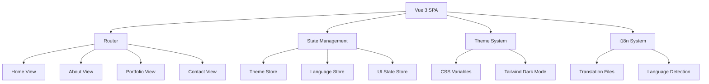

# Design Document

## Overview

This design document outlines the technical architecture and implementation approach for Zwe Htet Naing's luxury portfolio website. The application will be built as a Single Page Application (SPA) using Vue.js 3 with the Composition API, styled with Tailwind CSS, and featuring advanced theming, internationalization, and animation capabilities.

The design emphasizes performance, accessibility, and a luxurious user experience through careful attention to typography, spacing, color theory, and micro-interactions.

## Architecture

### High-Level Architecture



### Technology Stack

- **Frontend Framework**: Vue.js 3 with Composition API
- **Styling**: Tailwind CSS 3 with custom design tokens
- **State Management**: Pinia for reactive state management
- **Routing**: Vue Router 4 for SPA navigation
- **Internationalization**: Vue I18n for multi-language support
- **Animations**: Framer Motion Vue or custom CSS transitions
- **Form Handling**: VeeValidate for form validation
- **Build Tool**: Vite for fast development and optimized builds
- **Deployment**: Netlify/Vercel with automatic deployments

### Project Structure

```
src/
├── components/
│   ├── common/
│   │   ├── TheHeader.vue
│   │   ├── TheFooter.vue
│   │   ├── ThemeToggle.vue
│   │   └── LanguageToggle.vue
│   ├── sections/
│   │   ├── HeroSection.vue
│   │   ├── AboutSection.vue
│   │   ├── SkillsSection.vue
│   │   ├── ProjectsSection.vue
│   │   ├── ExperienceSection.vue
│   │   └── ContactSection.vue
│   └── ui/
│       ├── BaseButton.vue
│       ├── BaseCard.vue
│       ├── BaseInput.vue
│       └── BaseModal.vue
├── composables/
│   ├── useTheme.js
│   ├── useLanguage.js
│   ├── useScrollAnimation.js
│   └── useContactForm.js
├── stores/
│   ├── theme.js
│   ├── language.js
│   └── ui.js
├── locales/
│   ├── en.json
│   └── my.json
├── assets/
│   ├── styles/
│   │   ├── main.css
│   │   └── typography.css
│   └── images/
└── utils/
    ├── constants.js
    └── helpers.js
```

## Components and Interfaces

### Core Layout Components

#### TheHeader Component
- **Purpose**: Navigation and theme/language controls
- **Props**: None
- **Features**:
  - Sticky navigation with blur backdrop
  - Smooth scroll navigation to sections
  - Theme toggle with icon animation
  - Language selector with flag icons
  - Mobile hamburger menu with slide-out drawer

#### HeroSection Component
- **Purpose**: Landing section with animated introduction
- **Props**: None
- **Features**:
  - Animated text reveal with staggered timing
  - Particle background animation (subtle)
  - Call-to-action buttons with hover effects
  - Responsive typography scaling
  - Professional headshot with subtle glow effect

#### AboutSection Component
- **Purpose**: Professional summary and timeline
- **Props**: None
- **Features**:
  - Animated timeline with scroll-triggered reveals
  - CV download functionality
  - Professional summary with elegant typography
  - Education and career progression visualization

#### SkillsSection Component
- **Purpose**: Technical and soft skills showcase
- **Props**: None
- **Features**:
  - Skill categories with animated progress indicators
  - Hover tooltips with additional context
  - Icon integration for visual appeal
  - Responsive grid layout

#### ProjectsSection Component
- **Purpose**: Portfolio showcase with project cards
- **Props**: None
- **Features**:
  - Masonry or grid layout for project cards
  - Hover effects revealing project details
  - Technology stack badges
  - External link handling for demos/GitHub

#### ExperienceSection Component
- **Purpose**: Work history timeline
- **Props**: None
- **Features**:
  - Vertical timeline with company logos
  - Expandable job descriptions
  - Date range formatting
  - Scroll-triggered animations

#### ContactSection Component
- **Purpose**: Contact form and information
- **Props**: None
- **Features**:
  - Form validation with real-time feedback
  - Contact information display
  - Social media links
  - Success/error state handling

### Composables Architecture

#### useTheme Composable
```javascript
export function useTheme() {
  const isDark = ref(false)
  const systemPreference = ref('light')
  
  const toggleTheme = () => { /* implementation */ }
  const setTheme = (theme) => { /* implementation */ }
  const initTheme = () => { /* implementation */ }
  
  return { isDark, toggleTheme, setTheme, initTheme }
}
```

#### useLanguage Composable
```javascript
export function useLanguage() {
  const currentLanguage = ref('en')
  const availableLanguages = ref(['en', 'my'])
  
  const switchLanguage = (lang) => { /* implementation */ }
  const initLanguage = () => { /* implementation */ }
  
  return { currentLanguage, availableLanguages, switchLanguage, initLanguage }
}
```

#### useScrollAnimation Composable
```javascript
export function useScrollAnimation() {
  const observedElements = ref(new Map())
  
  const observeElement = (element, options) => { /* implementation */ }
  const unobserveElement = (element) => { /* implementation */ }
  
  return { observeElement, unobserveElement }
}
```

## Data Models

### Portfolio Data Structure

```javascript
// Personal Information
const personalInfo = {
  name: 'Zwe Htet Naing',
  title: 'Junior Backend Developer',
  tagline: 'Crafting clean, scalable, and secure backend solutions',
  contact: {
    phone: '+959258431631',
    email: 'zwehtet.dev@gmail.com',
    location: 'Mandalay, Myanmar'
  },
  summary: 'Professional summary text...'
}

// Skills Data
const skills = {
  technical: [
    { name: 'PHP', level: 85, icon: 'php-icon' },
    { name: 'Laravel', level: 90, icon: 'laravel-icon' },
    // ... more skills
  ],
  soft: [
    { name: 'Team Collaboration', description: '...' },
    // ... more skills
  ],
  languages: [
    { name: 'Burmese', level: 'Fluent' },
    { name: 'English', level: 'Basic' }
  ]
}

// Projects Data
const projects = [
  {
    id: 1,
    title: 'Real-Time Dynamic Website',
    role: 'Backend Developer',
    technologies: ['Laravel', 'Livewire', 'Alpine.js'],
    description: 'Developed an interactive website...',
    features: ['Real-time components', 'Dynamic behavior'],
    links: {
      demo: 'https://example.com',
      github: 'https://github.com/...'
    },
    image: '/images/project1.jpg'
  }
  // ... more projects
]

// Experience Data
const experience = [
  {
    id: 1,
    company: 'New Way Myanmar',
    position: 'Junior Backend Developer',
    duration: '2024 - Present',
    responsibilities: [
      'Built full-featured dynamic web apps',
      'Implemented robust APIs'
    ],
    logo: '/images/company-logo.png'
  }
  // ... more experience
]
```

### Theme Configuration

```javascript
const themeConfig = {
  light: {
    primary: '#1e40af', // Deep blue
    secondary: '#64748b', // Cool gray
    accent: '#f59e0b', // Gold
    background: '#ffffff',
    surface: '#f8fafc',
    text: {
      primary: '#0f172a',
      secondary: '#475569'
    }
  },
  dark: {
    primary: '#3b82f6', // Lighter blue
    secondary: '#94a3b8', // Lighter gray
    accent: '#fbbf24', // Brighter gold
    background: '#0f172a',
    surface: '#1e293b',
    text: {
      primary: '#f1f5f9',
      secondary: '#cbd5e1'
    }
  }
}
```

## Error Handling

### Form Validation Strategy
- **Client-side validation**: Real-time validation using VeeValidate
- **Error display**: Inline error messages with smooth transitions
- **Success feedback**: Toast notifications for successful submissions
- **Network errors**: Graceful handling with retry mechanisms

### Theme and Language Fallbacks
- **Theme fallback**: Default to system preference, fallback to light mode
- **Language fallback**: Default to English if Burmese translation missing
- **Storage errors**: Graceful degradation if localStorage unavailable

### Performance Error Handling
- **Image loading**: Lazy loading with placeholder and error states
- **Animation performance**: Respect `prefers-reduced-motion` setting
- **Network timeouts**: Appropriate timeout handling for external resources

## Testing Strategy

### Unit Testing
- **Components**: Vue Test Utils for component behavior testing
- **Composables**: Isolated testing of business logic
- **Utilities**: Pure function testing for helpers and constants

### Integration Testing
- **Theme switching**: End-to-end theme persistence and application
- **Language switching**: Complete translation and formatting testing
- **Form submission**: Full form validation and submission flow

### Performance Testing
- **Lighthouse audits**: Automated performance, accessibility, and SEO scoring
- **Bundle analysis**: Regular bundle size monitoring and optimization
- **Animation performance**: Frame rate monitoring for smooth animations

### Accessibility Testing
- **Screen reader compatibility**: ARIA labels and semantic HTML structure
- **Keyboard navigation**: Full keyboard accessibility for all interactions
- **Color contrast**: WCAG AA compliance for all color combinations
- **Focus management**: Proper focus handling for SPA navigation

## Design System

### Typography Scale
```css
/* Headings - Elegant serif font */
.text-display: font-family: 'Playfair Display', serif; /* 4rem/64px */
.text-h1: font-family: 'Playfair Display', serif; /* 3rem/48px */
.text-h2: font-family: 'Playfair Display', serif; /* 2.25rem/36px */
.text-h3: font-family: 'Playfair Display', serif; /* 1.875rem/30px */

/* Body text - Clean sans-serif */
.text-body-lg: font-family: 'Inter', sans-serif; /* 1.125rem/18px */
.text-body: font-family: 'Inter', sans-serif; /* 1rem/16px */
.text-body-sm: font-family: 'Inter', sans-serif; /* 0.875rem/14px */
```

### Spacing System
- **Base unit**: 0.25rem (4px)
- **Component spacing**: 1rem, 1.5rem, 2rem, 3rem, 4rem
- **Section spacing**: 4rem, 6rem, 8rem for vertical rhythm
- **Container max-width**: 1200px with responsive padding

### Animation Principles
- **Duration**: 200ms for micro-interactions, 400ms for transitions, 600ms for page changes
- **Easing**: Custom cubic-bezier curves for natural motion
- **Stagger**: 100ms delays for sequential animations
- **Respect motion preferences**: Disable animations for users with motion sensitivity

### Color Psychology
- **Deep blues**: Convey trust, professionalism, and technical expertise
- **Cool grays**: Provide neutral balance and sophisticated contrast
- **Gold accents**: Add luxury feel and highlight important elements
- **High contrast**: Ensure accessibility while maintaining visual hierarchy

This design provides a solid foundation for building a luxury portfolio website that meets all the specified requirements while maintaining excellent performance, accessibility, and user experience standards.